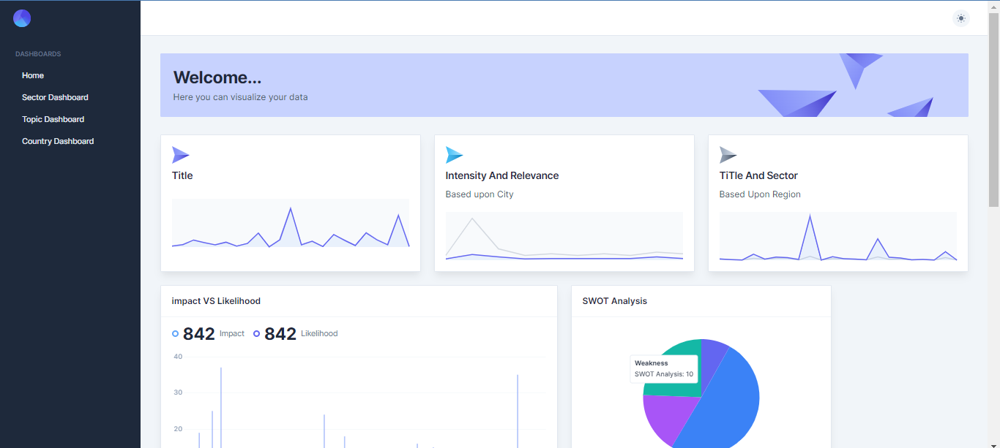

# Dashboard Frontend

Welcome to the Dashboard Frontend, a powerful user interface for your dashboard or web application. This frontend is built using React with Vite as the build tool, providing a modern and efficient development environment.



## Features

- Interactive dashboard user interface.
- Real-time data visualization and widgets.
- Responsive design for various devices.
- Customizable components and layouts.
- Seamless integration with your backend services.

## Technologies Used

- React: A JavaScript library for building user interfaces.
- Vite: A fast build tool and development server.
- HTML and CSS: Markup and styling languages for creating frontend components.
- Highcharts: A JavaScript charting library for data visualization.

## Getting Started

To run the Dashboard Frontend locally, follow these steps:

1. Clone this repository to your local machine:

   ```bash
   git clone https://github.com/your-username/dashboard-frontend.git
 2. Navigate to the project directory:
    ```
    cd dashboard-frontend
3. Install project dependencies:
    ```
   npm install
4.Start the development server:
  ```
  npm run dev
  ```
5. Open the application in your web browser at http://localhost:5173

 ## Usage
   Navigate through the dashboard using the provided navigation elements. Interact with various widgets and data visualization components to explore your data.
   
## Customization
   You can customize the Dashboard Frontend by modifying React components, styles, and layouts in the source code to fit your specific dashboard project. Add new features, widgets, or integrations as needed.

## Integration
Integrate the Dashboard Frontend with your backend services by making API requests to fetch data. Customize the integration to work seamlessly with your data sources.

